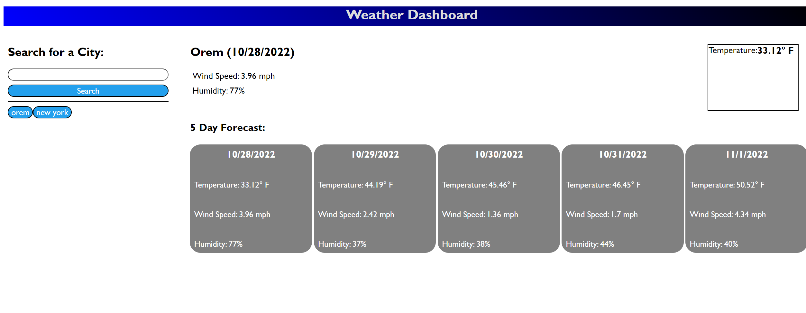

<!-- @format -->

# weather-checker

## Description

If you ever want to travel to a place, but want to check the weather first, you can use this website to search a five day forecast for that location. This tells you the temperature, wind speed, and humidity for any city that you search.

## Installation

N/A

## Usage

Includes usage of open weather APIs.

## Credits

openweathermap.org
5 day weather API
Geocoding API

## License

Please refer to the LICENSE in the repo.

Website can be found at:
https://prkrgreenwell.github.io/weather-checker
